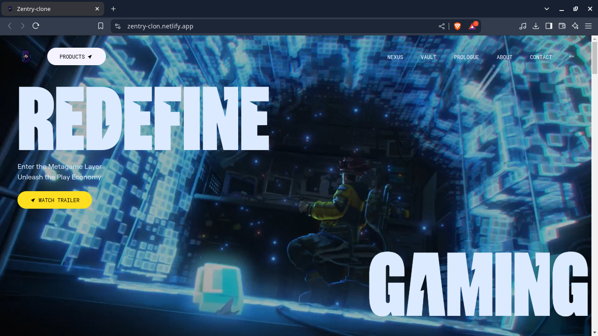

# Zentry Clone

A frontend-only clone of [Zentry](https://zentry.com), built using **React** and **Tailwind CSS**.  
Fully responsive, clean, and styled to match the original design.

🔗 **Live Demo:** [zentry-clon.netlify.app](https://zentry-clon.netlify.app/)

 <!-- Replace with actual image path -->

---

## 🚀 Tech Stack

- **React**
- **Tailwind CSS**
- **Netlify** (for deployment)

---

## 📁 Features

- Pixel-perfect UI clone of Zentry
- Responsive design across devices
- Modern, minimal layout using Tailwind
- Clean component structure

---

## 📦 Getting Started

Clone the repo and run locally:

```bash
git clone https://github.com/IRFAN-KHAN-git/zentry-clone.git
cd zentry-clone
npm install
npm run dev   # or npm start if you're using CRA
